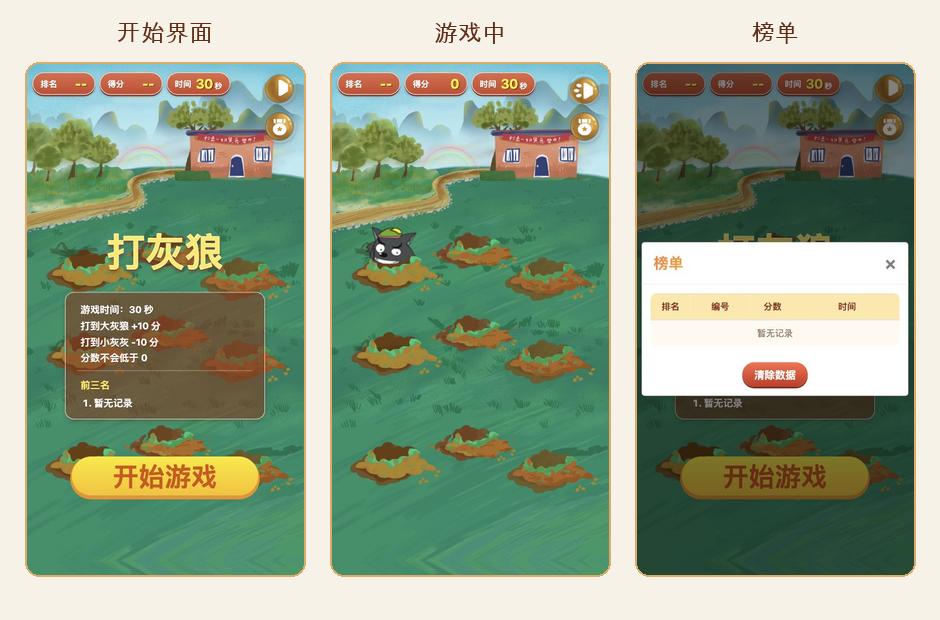

# Whack-a-Mole

[中文](README.md) | English

## Overview

This is a mobile-first H5 whack-a-mole style game. The player has 30 seconds to tap randomly appearing characters: hitting Grey Wolf increases the score, while hitting Little Grey decreases it. The project is built with static HTML, CSS, JavaScript, jQuery, and Bootstrap. No build tool is required.



## Features

- Mobile responsive layout based on rem units.
- 30-second game timer.
- Random spawning across 9 fixed positions.
- Two random target types: Grey Wolf and Little Grey.
- Hitting Grey Wolf adds 10 points; hitting Little Grey subtracts 10 points, with a minimum score of 0.
- Background music toggle.
- Hit and miss sound effects.
- Start screen with game rules and top-three ranking preview.
- Header status for current rank, score, and countdown timer.
- Local ranking records with player ID, score, and time, sorted by score in descending order.
- Ranking data can be cleared from the ranking modal.

## Project Structure

```text
.
├── index.html              # Page structure and ranking modal
├── css/
│   ├── style.css           # Game page styles
│   └── bootstrap.min.css   # Bootstrap styles
├── js/
│   ├── main.js             # Main game logic
│   ├── jquery-3.3.1.min.js # jQuery
│   └── bootstrap.min.js    # Bootstrap script
├── image/                  # Images required at runtime
├── audio/                  # Background music and sound effects
└── assets/                 # Documentation screenshots, unused images, and original sliced assets
```

## How to Run

This is a static web page. Open `index.html` directly in a browser to run it.

You can also serve it with any static server, for example:

```bash
python3 -m http.server 8000
```

Then open:

```text
http://localhost:8000
```

## Core Logic

1. After the page loads, `js/main.js` adjusts the root font size according to the screen width for mobile responsiveness.
2. When the player clicks “Start Game”, the start panel is hidden, background music starts, and both the countdown timer and spawn loop begin.
3. The spawn loop creates an `img` element, picks one of 9 positions, and randomly chooses whether to show Grey Wolf or Little Grey.
4. Character animation is implemented by switching image frames from `image/grey-wolf-0.png` to `image/grey-wolf-9.png` or from `image/little-grey-0.png` to `image/little-grey-9.png`.
5. Each spawned character can only be scored once.
6. Hitting Grey Wolf adds 10 points; hitting Little Grey subtracts 10 points.
7. When the countdown reaches zero, the spawn loop stops and the round ID, score, and time are recorded.
8. The game returns directly to the start screen, keeps the latest score in the header, and refreshes the rank and top-three preview.
9. Ranking data is stored in browser `localStorage`; clicking “Clear Data” removes local ranking records.

## Game Rules

- Each round lasts 30 seconds.
- Hit Grey Wolf: `+10` points.
- Hit Little Grey: `-10` points.
- The score never goes below 0.
