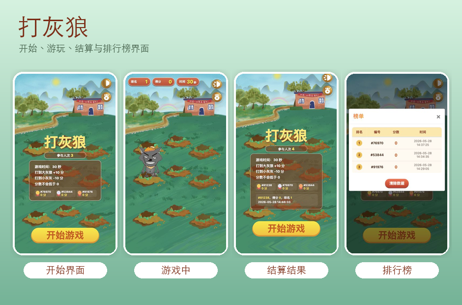

# Whack-a-Mole 打灰狼

中文 | [English](README-en.md)

## 项目介绍

这是一个移动端优先的 H5 打地鼠类小游戏。玩家在 30 秒内点击随机出现的角色：打中 Wolffy 和 Mole 加分，打中 Howie 扣分。项目使用静态 HTML、CSS、JavaScript、jQuery 和 Bootstrap 实现，不依赖构建工具。



## 功能特性

- 移动端 rem 自适应布局。
- 30 秒倒计时游戏流程。
- 9 个固定洞位随机出现目标。
- Wolffy、Howie 和 Mole 三类目标随机出现。
- 点击 Wolffy 和 Mole 加 10 分，点击 Howie 扣 10 分，最低分为 0。
- 背景音乐开关。
- 击中和误点音效。
- 开始界面展示游戏规则和前三名。
- 顶部展示当前排名、得分和倒计时。
- 本地榜单记录编号、得分和时间，并按分数从高到低排序。
- 榜单支持清除本地数据。

## 目录结构

```text
.
├── index.html              # 页面结构和榜单弹窗
├── css/
│   ├── style.css           # 游戏页面样式
│   └── bootstrap.min.css   # Bootstrap 样式
├── js/
│   ├── main.js             # 游戏主逻辑
│   ├── jquery-3.3.1.min.js # jQuery
│   └── bootstrap.min.js    # Bootstrap 脚本
├── image/                  # 项目运行所需图片
├── audio/                  # 背景音乐和点击音效
└── screenshot.png          # README 界面截图
```

## 运行方式

项目是静态页面，直接在浏览器中打开 `index.html` 即可运行。

也可以使用任意静态服务器启动，例如：

```bash
python3 -m http.server 8000
```

然后访问：

```text
http://localhost:8000
```

## 核心逻辑

1. 页面加载后，`js/main.js` 根据屏幕宽度设置根字号，实现移动端适配。
2. 点击“开始游戏”后，隐藏开始面板，播放背景音乐，启动倒计时和出狼循环。
3. 出狼循环会创建一个 `img` 元素，随机选择 9 个洞位之一，并随机决定生成 Wolffy、Howie 或 Mole。
4. 角色使用 `image/wolffy.png`、`image/howie.png`、`image/mole.png` 作为普通状态，点击后切换到 `image/wolffy-hit.png`、`image/howie-hit.png`、`image/mole-hit.png`，出现、被打和消失动画由 CSS 控制。
5. 玩家点击角色后，同一个目标只允许计分一次。
6. 点击 Wolffy 和 Mole 时分数加 10，点击 Howie 时分数减 10。
7. 倒计时结束后停止出狼循环，记录本局编号、得分和时间。
8. 游戏结束后直接返回开始界面，顶部保留本局得分，并刷新排名和前三名。
9. 榜单数据存储在浏览器 `localStorage` 中，点击“清除数据”可清空本地榜单。

## 规则说明

- 每局游戏时间为 30 秒。
- 打中 Wolffy：`+10` 分。
- 打中 Howie：`-10` 分。
- 打中 Mole：`+10` 分。
- 分数不会低于 0。
